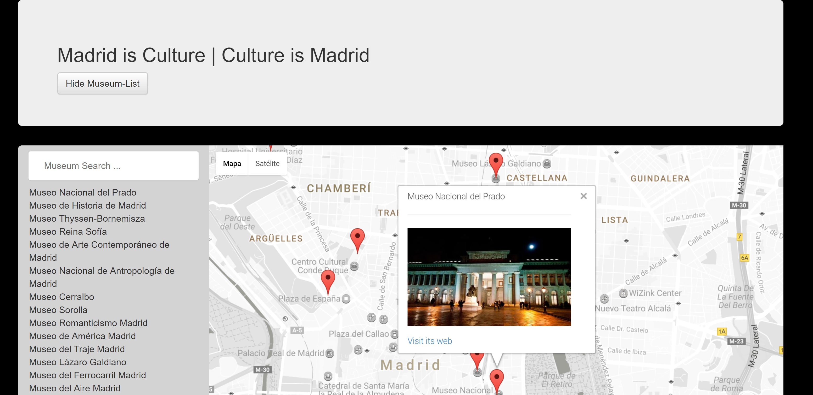

# Google Maps & Neo4j ...

Due to my home city is Madrid, I have implemented this map based on it ...

Madrid owns a lot of museums, maybe I forgot most of them so apologize for the incovenience ...

Just before of explaining the project, I have wanted to use Neo4j REST API, an API which allows you to connect vs graph Database where all museums info is allocated ...

lets get started ...

## How To ...

First of all, you have to clone the repository ...

```language
git clone https://github.com/davidmunoz4185/neighborhood.git
```

and open file __index.html__ in your favorite browser:



Take into account that if you have no connectivity, an alert message will appear ...

## Technology used ...

In order to finish this project I have used:

* Neo4j https://neo4j.com/
* Google Maps https://developers.google.com/maps/documentation/javascript/
* KnockOut http://knockoutjs.com/
* and tons of tons of google searches ...

## More ...

Please before any doubt you can contact me at david.munoz4185@gmail.com


